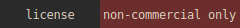
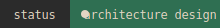
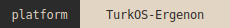
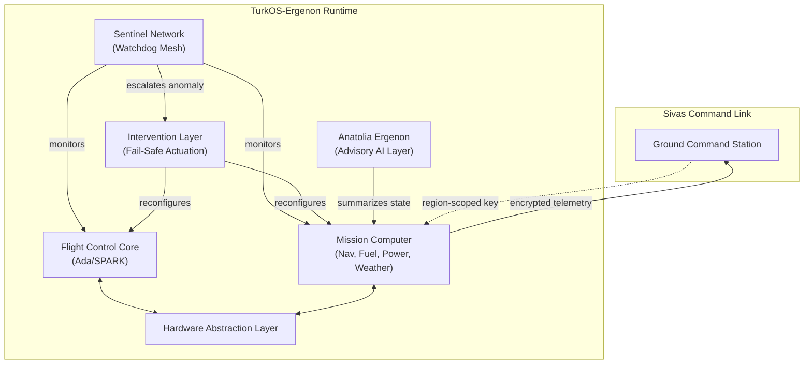
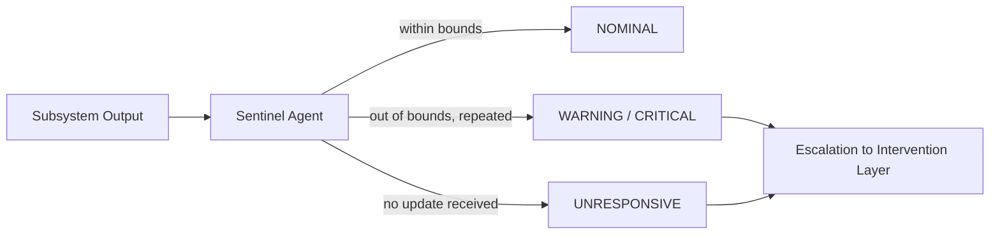

<div align="center">


<br/><br/>






</div>

---

## Table of Contents

- [Disclaimer](#disclaimer)
- [License](#license)
- [Design Philosophy](#design-philosophy)
- [Architecture Overview](#architecture-overview)
- [Module Table](#module-table)
- [The Sentinel Network](#the-sentinel-network)
- [Command Link and Regional Trust](#command-link-and-regional-trust)
- [Languages](#languages)
- [Naming Convention](#naming-convention)
- [Repository Layout](#repository-layout)
- [Roadmap](#roadmap)
- [Building and Testing](#building-and-testing)
- [Contributing](#contributing)
- [Status](#status)
- [Maintainer](#maintainer)

## Disclaimer

This is a research and educational software architecture project. It does
not contain, and will never contain, weapon targeting, guidance, fire
control logic, electronic warfare signal processing, or radar cross
section design data. Munitions-related modules are limited to passive
inventory and status telemetry only. Nothing in this repository is
intended for, or suitable for, deployment on real aircraft or hardware.

Every line of code in this repository is written from scratch. No
third-party libraries, frameworks, or externally generated assets are
used anywhere in the codebase or its documentation.

## License

This project is licensed under the Ergenon Systems Source-Visible
License. Commercial use is strictly and permanently prohibited under
any circumstances, with no exceptions, no waivers, and no paid licensing
path. See [LICENSE](./LICENSE) for the full text.

## Design Philosophy

Ergenon Systems is built on four non-negotiable principles:

1. No single point of failure. Every flight-critical computation has
   a redundant path and an independent observer watching it.
2. Trust nothing, including yourself. Every subsystem is monitored
   by a Sentinel agent that has no awareness of, and no dependency on,
   the internal logic of the subsystem it watches. A module never
   verifies its own correctness.
3. Determinism over cleverness. Flight-critical paths favor
   predictable, provable behavior over adaptive or opportunistic
   optimization. This is why Ada/SPARK anchors the flight control core.
4. Open architecture, closed misuse. The source is visible to all
   for study and research, but the license permanently forecloses
   commercial or operational use.

## Architecture Overview



## Module Table

| Layer | Function | Language | Status |
|---|---|---|---|
| Flight Control Core | Deterministic flight control laws, redundancy management | Ada/SPARK | Planned |
| Sentinel Network | Distributed watchdog mesh, per-subsystem bound checking | C | In Progress |
| Intervention Layer | Fail-safe isolation and reconfiguration on fault escalation | C | Planned |
| Command Link | Encrypted uplink, region-scoped key authority | C / Rust | Planned |
| Mission Computer | Navigation, fuel, power, weather, equipment status | C | Planned |
| Anatolia Ergenon | Advisory AI summarization layer for pilot workload reduction | Rust | Planned |
| Hardware Abstraction Layer | UART, SPI, I2C, CAN, GPIO, ADC interfaces | C | Planned |
| Ergenon Rule DSL | Declarative Sentinel Network threshold configuration | Custom DSL | Planned |

## The Sentinel Network

Every flight-critical subsystem is paired with a lightweight Sentinel
agent. A Sentinel agent has exactly one job: observe a single value
coming out of a single subsystem, compare it against bounds it was
configured with, and report a state.



Sentinel agents never call into the subsystem they observe, and the
subsystem never calls into its own Sentinel agent. This separation is
intentional: a corrupted or buggy subsystem cannot disable, deceive, or
silence the agent that watches it.

## Command Link and Regional Trust

Telemetry and position data are encrypted before leaving the aircraft.
Position data uses a region-scoped key authority model: the aircraft
encrypts its position using the public key belonging to whichever
ground region it currently reports to, so that only the responsible
station can decrypt it. No other station, including other friendly
stations outside that responsibility area, holds the matching key.

## Languages

- Ada/SPARK -- flight-critical control loops and redundancy logic,
  chosen for its formal verification tooling and decades of aerospace
  certification precedent.
- C -- RTOS kernel, HAL, and drivers, where direct hardware control
  and minimal runtime overhead are required.
- Rust -- memory-safe, non-real-time services such as advisory AI
  summarization and cryptographic relay logic.
- Ergenon Rule DSL -- a declarative configuration language, written
  entirely from scratch, for expressing Sentinel Network thresholds
  and escalation rules without recompiling core logic.

## Naming Convention

Module codenames throughout this codebase draw, non-uniformly, from
across Turkic history and culture -- Gokturk, Seljuk, Ottoman, Crimean
Tatar, Karakhanid, Avar, Khazar, Kipchak, and others. All code, comments,
and documentation are written in English; only proper module names carry
this cultural reference.

## Repository Layout

```
Ergenon-Systems/
  src/
    core/        Sentinel Network, scheduler, kernel logic (C)
    ada/         Flight Control Core (Ada/SPARK)
    rust/        Anatolia Ergenon, Command Link relay (Rust)
    hal/         Hardware Abstraction Layer (C)
    security/    Secure boot, key authority (C)
    dsl/         Ergenon Rule DSL parser and runtime
  docs/
    architecture/  Design documents per layer
    diagrams/      Standalone diagram sources
    assets/        Native SVG visual assets
  test/            Unit and integration tests
  config/          Sentinel bounds, DSL rule files
  LICENSE
  README.md
```

## Roadmap

- [x] Phase 0 -- Foundation. License, README, repository structure.
- [ ] Phase 1 -- Sentinel Network. Generic watchdog agent, bound
      checking, escalation path, unit tests.
- [ ] Phase 2 -- Intervention Layer. Fail-safe reconfiguration logic
      triggered by Sentinel escalation.
- [ ] Phase 3 -- Hardware Abstraction Layer. UART, SPI, I2C, CAN,
      GPIO, ADC driver interfaces.
- [ ] Phase 4 -- Flight Control Core. Ada/SPARK control laws,
      sensor fusion, redundancy management.
- [ ] Phase 5 -- Mission Computer. Navigation, fuel and power
      management, weather integration, passive equipment status.
- [ ] Phase 6 -- Command Link. Encrypted telemetry uplink, regional
      key authority.
- [ ] Phase 7 -- Anatolia Ergenon. Advisory AI summarization layer.
- [ ] Phase 8 -- Ergenon Rule DSL. Declarative Sentinel configuration
      language and runtime.
- [ ] Phase 9 -- TurkOS-Ergenon Integration. Full runtime integration
      with the TurkOS kernel.

## Building and Testing

Build and test instructions will expand as each phase lands. Every
module added to this repository ships with a corresponding test under
test/ before it is considered complete. No build tooling depends on
third-party packages beyond the standard toolchains for Ada, C, and
Rust.

## Contributing

This project is open-source for study, research, and non-commercial
collaboration. Contributions are welcome via pull request. By
contributing, you agree that your contribution is licensed under the
same Ergenon Systems Source-Visible License, and that it is written
entirely from scratch.

## Status

Architecture in active design. No flight-critical module is complete or
verified. Do not use this software in any real aircraft or hardware.

## Maintainer

<div align="center">

Batuss -- [batuss.com](https://batuss.com)

</div>
