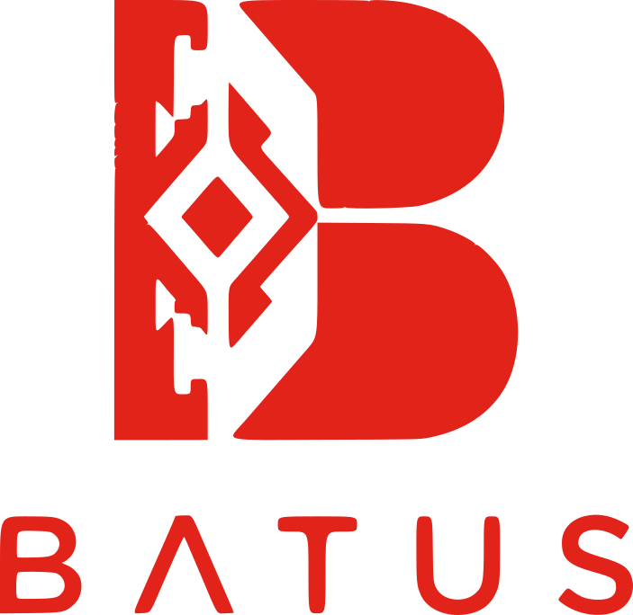
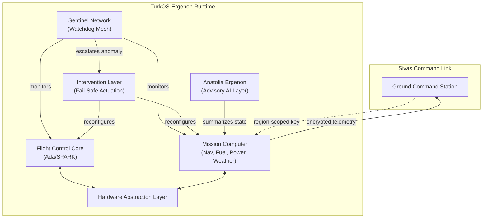

# ERGENON SYSTEMS

---

## Disclaimer

This is a research and educational software architecture project. It does
not contain, and will never contain, weapon targeting, guidance, fire
control logic, electronic warfare signal processing, or radar cross
section design data. Munitions-related modules are limited to passive
inventory and status telemetry only.

## License

This project is licensed under the **Ergenon Systems Source-Visible
License**. Commercial use is strictly and permanently prohibited under
any circumstances, with no exceptions. See [LICENSE](./LICENSE).

## Architecture Overview

## Module Table

| Layer | Function | Language |
|---|---|---|
| Flight Control Core | Deterministic flight control laws, redundancy management | Ada/SPARK |
| Sentinel Network | Distributed watchdog mesh, per-subsystem bound checking | C |
| Intervention Layer | Fail-safe isolation and reconfiguration on fault escalation | C |
| Command Link | Encrypted uplink, region-scoped key authority | C / Rust |
| Mission Computer | Navigation, fuel, power, weather, equipment status | C |
| Anatolia Ergenon | Advisory AI summarization layer for pilot workload reduction | Rust |
| Hardware Abstraction Layer | UART, SPI, I2C, CAN, GPIO, ADC interfaces | C |
| Ergenon Rule DSL | Declarative Sentinel Network threshold configuration | Custom DSL |

## Languages

- **Ada/SPARK** — flight-critical control loops and redundancy logic
- **C** — RTOS kernel, HAL, drivers
- **Rust** — memory-safe non-real-time services
- **Ergenon Rule DSL** — declarative configuration language for Sentinel
  Network thresholds and rules

## Naming Convention

Module codenames throughout this codebase draw, non-uniformly, from
across Turkic history and culture — Gokturk, Seljuk, Ottoman, Crimean
Tatar, Karakhanid, Avar, Khazar, Kipchak, and others. All code, comments,
and documentation are written in English; only proper module names carry
this cultural reference.

## Status

Architecture in active design. No flight-critical module is complete or
verified. Do not use this software in any real aircraft or hardware.

## Maintainer

**Batuss** — [batuss.com](https://batuss.com)

